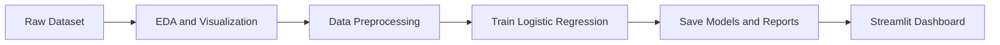
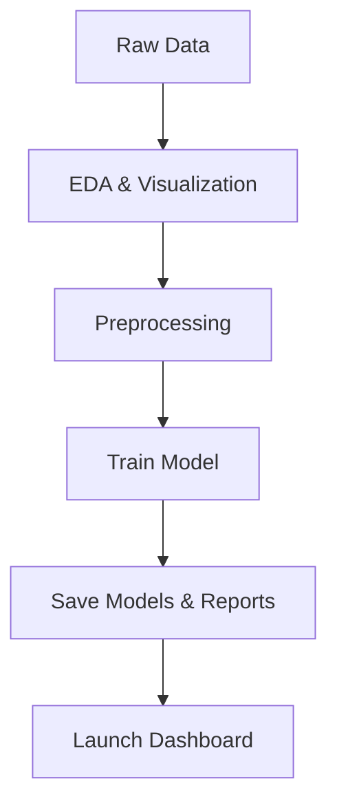

# Home Credit Default Risk Prediction

This project builds a **logistic regression** model to predict loan default risk using the Home Credit dataset. It includes end-to-end processing: exploratory data analysis (EDA), data cleaning and encoding, model training, and a Streamlit web app for visualization and prediction. Core features include automated reports (accuracy, precision, recall, F1, ROC-AUC), saved model artifacts (scaler, encoders, feature list), and a Dockerized setup for reproducibility. This concise README provides an overview of the project, setup steps, usage examples, and architecture diagrams.

[]() []() []() []()

**Summary:** The repository includes data preprocessing and modeling code under `src/` and `training/`, a Streamlit dashboard in `streamlit/`, plus Dockerfiles for containerization. The workflow pipeline is:



GitHub supports embedding Mermaid diagrams like the above for workflows.

## 🗂 Project Structure

For clarity, the repository structure is outlined below (see also *Project Structure* in [MLOps guidelines]). It helps new users navigate the code and data:

```text
├── data
│   ├── application_train.csv            # Raw training data (Kaggle)
│   ├── df_processed.csv                # Processed data (features only)
│   ├── df_final.csv                    # Final dataset (features + target)
│   ├── models
│   │   ├── feature_names_20251228_033558.pkl     # List of model feature names
│   │   ├── label_encoders_20251228_033558.pkl   # Categorical encoders
│   │   ├── logistic_regression_20251228_033558.pkl  # Trained model
│   │   └── scaler_20251228_033558.pkl           # Scaler for numeric features
│   └── reports
│       ├── training_report_20251228_033558.txt  # Model metrics & summary
│       └── training_results_20251228_033558.json# Detailed training results (JSON)
├── images
│   ├── before_handle            # EDA charts (raw data)
│   ├── before_train             # EDA charts (after cleaning)
│   └── after_train              # Post-training charts
├── src
│   ├── Dockerfile
│   ├── create_images.py        # Script to generate EDA plots
│   ├── handle
│   │   ├── eda.py              # Data analysis and plotting
│   │   └── fill_null.py        # Missing-value imputation
│   └── main.py                 # Run EDA and preprocessing pipeline
├── training
│   ├── Dockerfile
│   ├── feature_config.py       # Feature definitions (encoding rules, etc.)
│   ├── requirements.txt
│   └── train.py                # Model training script
├── streamlit
│   ├── Dockerfile
│   ├── app.py                  # Streamlit app (dashboard & prediction UI)
│   └── requirements.txt
└── docker-compose.yml
```

## 🚀 Features

Key features of this project include:

- **Exploratory Data Analysis (EDA):** Visualize target distribution, missing values, feature correlations, and distributions.
- **Data Preprocessing:** Impute missing values, label-encode categorical features, scale numeric features, and output processed data.
- **Model Training:** Train a **Logistic Regression** model. Evaluation metrics (accuracy, precision, recall, F1, ROC-AUC) are calculated and saved.
- **Model Artifacts:** Persist the trained model (`.pkl`), feature list, label encoders, and scaler for later use.
- **Automated Reports:** Generate a text report and JSON file with model performance and training details.
- **Visualization:** Automatically generate charts *before* and *after* data processing, saved in `images/` (see next section).
- **Streamlit Dashboard:** Interactive UI to view data summary and model predictions via `streamlit/app.py`.
- **Containerized Deployment:** Dockerfiles and `docker-compose.yml` enable easy setup of the pipeline and the dashboard.

Each of these highlights is summarized in bullet form, as recommended for README highlights.

## 📊 Data and Artifacts

### Data Files

| Filename                     | Purpose                                                      | Location      |
|------------------------------|--------------------------------------------------------------|---------------|
| `data/application_train.csv` | Original Home Credit training data from Kaggle (raw features and target). | `data/`       |
| `data/df_processed.csv`      | Output of preprocessing: cleaned and encoded features (no target). | `data/`       |
| `data/df_final.csv`          | Final dataset including processed features plus target label. | `data/`       |

* The raw `application_train.csv` is the source data. We document its origin and any processing steps (imputation, encoding) as part of reproducibility.  
* `df_processed.csv` and `df_final.csv` are generated by `src/main.py` (see Usage).

### Model Artifacts

| Filename                                 | Purpose                                 | Location        |
|------------------------------------------|-----------------------------------------|-----------------|
| `models/feature_names_20251228_033558.pkl`    | Pickle file storing the list of feature names used by the model. | `data/models/`  |
| `models/label_encoders_20251228_033558.pkl`  | Pickle file for categorical label encoders (to transform new data). | `data/models/`  |
| `models/scaler_20251228_033558.pkl`          | Pickle file for the numeric feature scaler (e.g., StandardScaler). | `data/models/`  |
| `models/logistic_regression_20251228_033558.pkl` | The trained Logistic Regression model (pickle). | `data/models/`  |

These artifacts capture the **model architecture and preprocessing** details. Storing encoders, scalers, and feature names ensures consistent data transformation during prediction (important for reproducibility).

### Training Reports

| Filename                                       | Purpose                                | Location        |
|------------------------------------------------|----------------------------------------|-----------------|
| `reports/training_report_20251228_033558.txt`   | Summary of training metrics (accuracy, precision, recall, F1, ROC-AUC) in human-readable text. | `data/reports/` |
| `reports/training_results_20251228_033558.json` | Detailed training results and evaluation metrics in JSON format (easy parsing or logging). | `data/reports/` |

These reports allow quick inspection of the model’s performance and can be used for experiment tracking. Including such metrics tables in documentation is a common practice for ML projects.

## 📈 Visualizations

The `images/` directory contains PNG charts illustrating the data and results. We leverage visual aids to make key insights clear. Subfolders include:

- **before_handle:** Charts on the *raw* dataset (e.g., missing values heatmap, feature distributions, target class balance, correlation heatmap, top features).
- **before_train:** Charts after initial cleaning (similar plots to show the effect of imputation/encoding).
- **after_train:** Charts related to model training (e.g., target distribution, ROC curve, feature importance, etc.). Currently it includes target distribution and correlation after modeling.

Each chart has a descriptive filename (e.g., `TARGET_distribution.png`). Including these visualizations in the documentation helps users understand the data and model as recommended.

## 💻 Installation

Clone the repository and set up the environment. We assume Python 3.10+.

```bash
# Clone the repository
git clone https://github.com/your_username/Home-Credit-Default-Risk.git
cd Home-Credit-Default-Risk

# (Optional) Create a virtual environment for Python dependencies
python -m venv .venv
# Activate the virtual environment:
#   On Windows: .venv\Scripts\activate
#   On Linux/macOS: source .venv/bin/activate

# Install dependencies for training and Streamlit
pip install -r training/requirements.txt
pip install -r streamlit/requirements.txt
```

These commands are copy-paste ready, following best practices for README setup instructions. The Docker setup is also available:

```bash
# Using Docker Compose (requires Docker installed)
docker compose build
docker compose up
```

This builds the training and app images and starts the services. The web dashboard will be accessible (e.g., at http://localhost:8501).

## ▶️ Usage

Follow these steps to run the full pipeline:

1. **Data Processing & EDA:**  
   ```bash
   python src/main.py
   ```  
   This performs EDA (generates plots in `images/before_handle`), handles missing values and encoding, and outputs `data/df_processed.csv` and `data/df_final.csv`. Key output: processed dataset files and updated charts (as described above).

2. **Model Training:**  
   ```bash
   python training/train.py
   ```  
   Trains the logistic regression model using `df_processed.csv`. It outputs model artifacts in `data/models/` (scaler, encoders, feature names, model) and report files in `data/reports/` (text and JSON). It also generates evaluation metrics (accuracy, F1, etc.) and ROC curve in `images/after_train`.

3. **Launch Dashboard:**  
   ```bash
   streamlit run streamlit/app.py
   ```  
   Starts the Streamlit app. The dashboard allows you to explore data insights and input custom customer data for prediction using the trained model.

4. **Via Docker Compose (all-in-one):**  
   ```bash
   docker compose up
   ```  
   Runs both the data/model pipeline and the Streamlit app in containers. 

By following these examples, users can reproduce the entire workflow. Including usage examples with clear commands is recommended for reader usability.

## 🛠 Tech Stack

- **Languages & Libraries:** Python 3.10, Pandas, NumPy, Scikit-learn, Matplotlib/Seaborn, Streamlit, Pickle.  
- **Containerization:** Docker & Docker Compose for consistent environments.  
- **Data:** Home Credit Kaggle dataset (raw CSV).  

This stack provides a standard ML toolchain for data processing, modeling, and deployment.

## 🔄 Workflow

The project workflow (visualized above) can be summarized as:



We include a Mermaid flowchart since GitHub renders Mermaid diagrams from fenced code blocks. This helps new users quickly grasp the pipeline steps.

## 🎯 Future Improvements

Potential extensions to enhance this project:

- **Additional Models:** Add ensemble algorithms (Random Forest, XGBoost, LightGBM) for comparison.
- **Hyperparameter Tuning:** Use tools like GridSearch or Bayesian optimization to improve model performance.
- **Explainability:** Integrate SHAP or LIME to interpret feature impacts on predictions.
- **Robust Evaluation:** Incorporate cross-validation and more detailed error analysis.
- **Continuous Integration:** Add testing and automated pipeline (e.g. GitHub Actions).
- **Documentation:** Expand docs with a website (MkDocs/Sphinx) as the project grows.

Such future work would deepen the analysis and utility of the repository.

## 📑 License

*License: Unspecified* – add a license (e.g., MIT) to clarify usage terms. As [best practices suggest](#), explicitly stating licensing helps others use or contribute to your code.

## 👨‍💻 Author

**Nguyen Nam Lap** – Machine Learning Engineer (contact: [email] or [GitHub profile]). 

*This README follows recommended guidelines for clarity and structure.*

